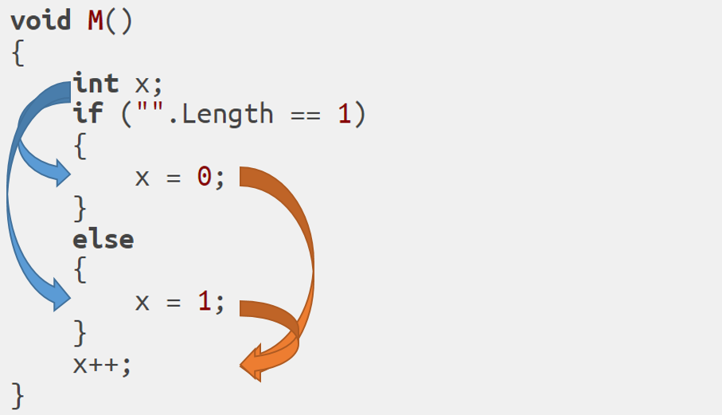

class: center, middle

# Definite Assignment and Local Functions

---

# Agenda

1. Review of definite assignment

1. Theoretical foundations

1. How are local functions different?

1. Algorithm for local functions

1. Proof of correctness

1. Roslyn Implementation

---

# What is definite assignment?

- Tracks when a variable is assigned
        
- Form of _dataflow analysis_:

    - Tracking of state across the control flow of the program

    - In this case, state = assignment

### _Meet on all paths:_

A variable is _definitely assigned_ at a particular
point when the variable is assigned in all branches leading to that point

---

# Definite Assignment

- Given a control flow graph, data "flows" along the edges of that graph, e.g.



- All assignment paths "meet" at `x++`
    - The set of definitely assigned variables is the _intersection_ of the paths

---

# Definite Assignment Equations

### _Meet on all paths solution:_

$$
\begin{matrix}
succ(s) = \textrm{successor stmts of }s             \\\\
pred(s) = \textrm{predecessors of }s                \\\\
in(s) = \textrm{program just before }s              \\\\ 
out(s) = \textrm{program just after }s              \\\\
assign(s) = \textrm{variables assigned by }s        \\\\
\\\\
in(s) = \bigcap_{s\prime \in pred(s)} out(s\prime)  \\\\
out(s) = assign(s) \cup in(s)
\end{matrix}
$$

_Forward-must_ analysis: Data flows _forward_ on every branch and _must_ be
  available on every branch to be available at _in(s)_

---

# Dataflow Equation Generalization 

- Definite assignment is _forward_ analysis: uses \\(pred(s)\\) to decide \\(in(s)\\)
- Definite assignment is _must_ analysis: uses \\(\cap\\) at branch "meet"
- "Set state" = assignment = \\(gen(s)\\)
- "Unset state" = \\(kill(s)\\)
    - Unused for definite assignment, as variables cannot be "unassigned" in C#

$$
\begin{matrix}
\wedge = \textrm{meet}                                      \\\\
in(s)/pred(s) = \textrm{forward, reverse it for backward}   \\\\
\\\\
in(s) = \wedge_{s\prime \in pred(s)} out(s\prime)           \\\\
out(s) = gen(s) \cup (in(s) - kill(s))
\end{matrix}
$$

---

# Algorithm

- Gary Kildall, 1973

<div style="display: block; margin: auto; width: 500px;"><pre>
out(s) = \(\top\) for all statements
stmts = { all statements }

do
{
    take s from stmts
    in(s) = \( \wedge_{s\prime \in pred(s)} \ out(s\prime) \)

    temp = gen(s) \( \cup \) (in(s) - kill(s))
    if (temp != out(s))
    {
        out(s) = temp
        stmts = stmts \( \cup \) succ(s)
    }
} while (stmts \(\neq \emptyset \))
</pre></div>

---

# Correctness

- Correct means completes and is `\(\leq\)` Meet Over All Paths (MOP) solution 
    - `\(\leq\)` because we can be more conservative (mark things as possibly
      unassigned)

- Completion: Relatively simple for definite assignment.
    1. If nothing new is assigned, algorithm has reached a fixed point and is
       complete

    2. Otherwise, a new variable is assigned. Since nothing is ever unassigned,
       the set of assigned variables monotonically increases. With a finite list
       of variables, this must take a finite number of iterations.

- Fixed-point (FIX) solution `\(\leq\)` MOP is a little more difficult...

---

# Dataflow as a lattice

- A **partial order** is an operator `\(\leq\)` over a set `\(S\)` st.
    - `\(\leq\)` is _reflexive_, _antisymmetric_, and _transitive_

- A poset is a **meet-semilattice** if every pair in `\(S\)` have a _greatest lower bound_
 (infimum)
    - Greatest lower bound `\(i\)`:  `\(\forall x \in S. x \leq i \)`, where
      `\(x\)` is a lower bound
    - `\(x \wedge y\)` is the greatest lower bound for `\(x\)` and `\(y\)`

- FIX `\(\leq\)` MOP if dataflow forms a semilattice and meet operator is
  *monotone*, i.e. `\( f(x \wedge y) \leq f(x) \wedge f(y) \)`

    - Intuitively, it's always safe to take a 'meet', no matter the path order
    - Luckily, `\(\cap\)` is trivially monotonic

- So FIX `\(\leq\)` MOP, and definite assignment is sound!

---

# So what about local functions?

- At first glance, if they look like methods, why not treat them that way?
    - But they can capture variables, which must be definitely assigned

- OK, sounds like lambdas.
    - But lambdas need captured variables at the declaration point.
        - Local functions don't need them until they're used.

    - Lambdas also can't definitely assign variables

```csharp
void M()
{
    int x;
    L(); // Assigns x, but in first pass we haven't even seen L() yet
    Console.WriteLine(x);

    void L() => x = 0;
}
```

---

# Local function algorithm

- Visit local functions first and separately

    - Clear set of possibly unassigned captured variables on entry

    - _Record_ captured reads and writes rather than propogating to the 
      containing method

    - On 'use' of a local function, replay the recorded captured reads
      and writes

- Visit all other statements normally

- Repeat until we reach a fixed point

- Formally, `\(gen(s)\)` for calls of local functions involves the
  previous, separate dataflow analysis.

---

# Formal analysis

- Can we use the same analysis?
    - Yes, but it's more complicated

- Local functions reads are cleared on every pass

    - Subsequent passes can have _fewer_ unassigned captured vars
      due to new assignments

    - Thus, not monotonic

    - Looks like the algorithm may have distinct 'phases', though

---

# Local function phases

Rewriting the algorithm as three separate phases:

- Visit each block
    1. Record and replay just the local function writes until a fixed point
        - Only writes affect other writes, so no other state inferferes

    2. Record and replay just the local function reads until a fixed point
        - No need to clear the read set on every iteration; only new writes
          can remove "read before assigned", but writes are decided in (1)

    3. Visit remaining statements (outside local functions) until fixed point.
       Doesn't affect any of the two phases, but uses the results.

---

# Formal Analysis

- **Writes** form a _meet-semilattice_ with meet = assign-intersection

    - _Assignment-intersection_ is trivially monotonic

- **Reads** form a _join-semilattice_ with join = read-union

    - Same as a _meet-semilattice_, but flip the bounds

    - _Read-union_ is trivially monotonic

- Remaining visits are identical to original algorithm, just with previous
  information replayed during `\(gen(s)\)` of local function calls
    - Already proved to be a _meet-semilattice_ and monotonic

- `\(\therefore\)` local function `\( FIX \leq MOP \)`!

---

# So how is this actually implemented?

- Definite assignment, specifically, is implemented in `DataFlowPass`
    - Mostly deals with visitation minutae and reporting
- Actual state tracking is in `AbstractFlowPass`

```csharp
public override BoundNode VisitIfStatement(BoundIfStatement node)
{
    // 5.3.3.5 If statements
    VisitCondition(node.Condition);
    LocalState trueState = StateWhenTrue;
    LocalState falseState = StateWhenFalse;
    SetState(trueState);
    VisitStatement(node.Consequence);
    trueState = this.State;
    SetState(falseState);
    if (node.AlternativeOpt != null)
    {
        VisitStatement(node.AlternativeOpt);
    }

    IntersectWith(ref this.State, ref trueState);
    return null;
}
```

---

# What about local functions?

- Mostly in `DataFlowPass.LocalFunctions`

- Details are in `VisitLocalFunctionStatement`
    - Local function state is cleared and reads are cleared and saved

```csharp
var savedState = this.State;
this.State = this.ReachableState();
 
var usages = GetOrCreateLocalFuncUsages(localFunc.Symbol);
var oldReads = usages.ReadVars;
usages.ReadVars = BitVector.Empty;
```

- One useful optimization: reads/writes are only dirty if "used" before
  set is changed
    - i.e., if write is added to local function write set, a second pass
      is only needed if the write has already been "replayed"
    - Most programs take only one pass!